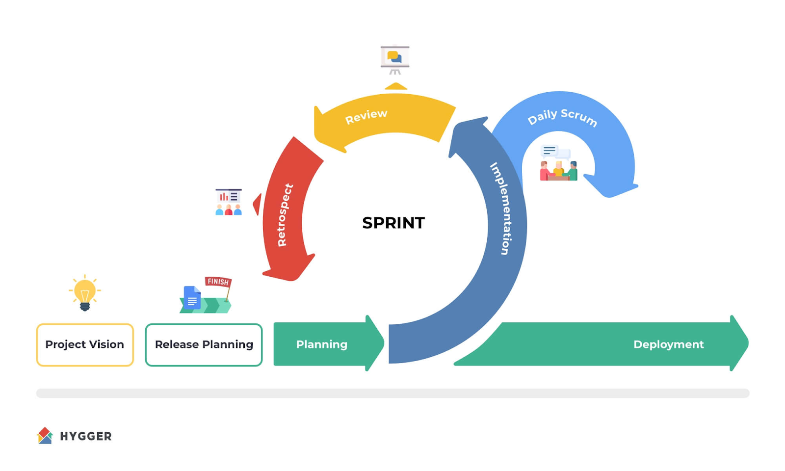
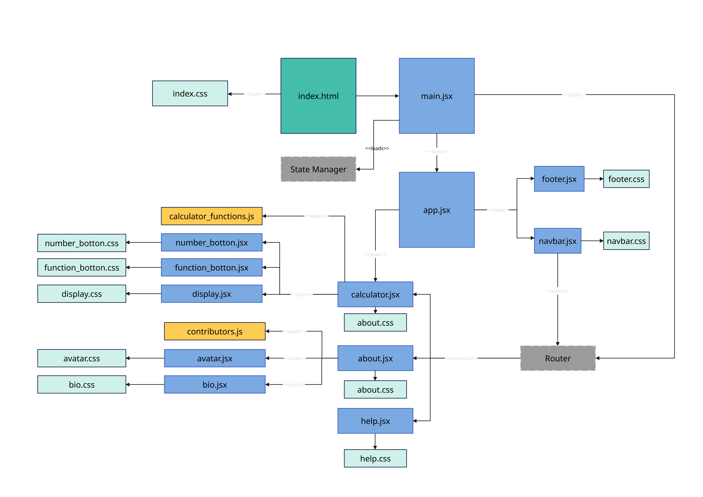

<!--
 Copyright 2023 Ryan McGuinness
 
 Licensed under the Apache License, Version 2.0 (the "License");
 you may not use this file except in compliance with the License.
 You may obtain a copy of the License at
 
     http://www.apache.org/licenses/LICENSE-2.0
 
 Unless required by applicable law or agreed to in writing, software
 distributed under the License is distributed on an "AS IS" BASIS,
 WITHOUT WARRANTIES OR CONDITIONS OF ANY KIND, either express or implied.
 See the License for the specific language governing permissions and
 limitations under the License.
-->

# Team Project

# Agile Methodology

## Agile roles

| Role Name | Responsibilities | Team Member | 
| --- | --- | --- |
| Product Owner | Sets clear direction, prioritizes backlog, manages the stakeholders. |  | 
| Scrum Master | Holds the team together. Runs ceremonies, removes blockers. |  | 
| Developer | Writes developers stories,
Executes backlog, working product every sprint. |  | 
| Product Sponsor / Stakeholders | Funds and champions products. | All | 

## Agile Life Cycle

SCRUM Life-cycle

* Product / Project Vision - establish a clear vision of the product, gain stakeholder buy-in, provide clear feedback to the team.
* Release Planning - Establish sprint cycles and clear expectations of each sprint including releases.
* Sprint Planning - Also known as iteration planning, assigns developer stories and deliverables for the sprint.
* Implementation (development) - The time the development team takes to complete sprint stories
* Review (demo) - Development team demonstrates the work completed, fixes and issues, and deploys working code.
* Retrospective (Stop, Start, Improve) - Team discusses what to stop doing, what to improve, and what to start / try doing to improve.
* Release - Release code.

Daily Standup - What I did yesterday, what I am doing today, identify and remove blockers.

# Project Scope

As a development team we will create a single page application using React with Vite. The application will consist of three screens: 1) The main calculator, 2) A help page, and 3) An about us page.

The calculator MUST[^1] support addition, subtraction, multiplication and division. It MUST support positive and negative numbers in the following number sets: natural, whole, integer, and rational. It MUST support correct application of mathematical operations over time and in the correct order. It SHOULD be well decorated using CSS with a consistent theme between pages.

The help page SHOULD explain how to use the calculator and explain any error conditions the user may encounter.

The About Us page MUST contain an avatar, email, and short biography of each member of the team.

# Iteration One
Every team member will come prepared to our next meeting. Everyone will be responsible for bringing a list of tasks they believe will need to be completed in order to deliver the project scope defined above. Every Team member will draw a site diagram to illustrate the flow of the application described. (This can be digital or on a piece of paper.)

#### Stretch goal:
Consider the layout of each page, and determine which parts can be reused.

(WARN_UNRECOGNIZED_ELEMENT: PAGE_BREAK)

# Architectural View
The following diagram represents the total composition of the proposed work.

Iteration 2:
Given the architectural view above, fill in the backlog with developer stories in the following format.

“As a developer I will … so that …”

Examples:

“As a developer I will create a development branch for my group so that we can isolate our component work from others until it is ready to be merged.”

“As a developer I will create the display component and css so that numerical functions and current state can be displayed to the calculator user.”

[^1]: RFC 2119