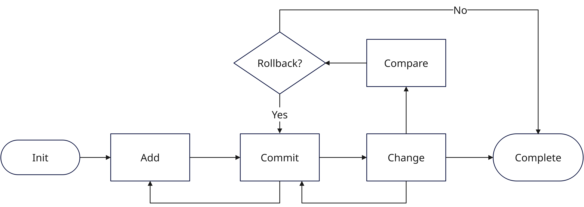
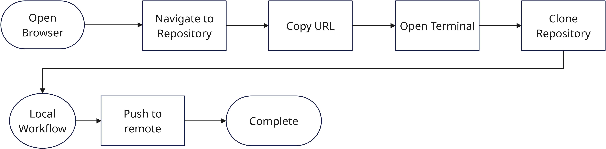

<!--
 Copyright 2023 Ryan McGuinness
 
 Licensed under the Apache License, Version 2.0 (the "License");
 you may not use this file except in compliance with the License.
 You may obtain a copy of the License at
 
     http://www.apache.org/licenses/LICENSE-2.0
 
 Unless required by applicable law or agreed to in writing, software
 distributed under the License is distributed on an "AS IS" BASIS,
 WITHOUT WARRANTIES OR CONDITIONS OF ANY KIND, either express or implied.
 See the License for the specific language governing permissions and
 limitations under the License.
-->
# Git Commands and Workflow

By now, everyone should have Git on their computer, and it should be accessible from the command line. In this section, we will discuss setting up Git and understanding two team workflows.

Reference URL: https://git-scm.com/docs

## Overview
Simply put, Git allows you to save changes over time. Git works independently of a Git server like GitHub or GitLab. When you use the command `git init .`, it creates an empty git repository in the current directory. Git only revisions what you check in, and it only shares when you want to share. The additional functionality of Git allows you to manage multiple versions over time, and allows you to work with more than one person on the same document by providing utilities for merging documents and changes while keeping track of who made the changes.

With this in mind, we will now set up Git and cover the most common workflows.

## Git global setup
Much like any tool you use on your computer (office, email, etc), you MUST provide a small amount of information to personalize how your copy works. The same is true for Git. Git uses global variables to store these preferences.

The most common preferences are listed below:

| Option             | Common Values                                                            |
| ------------------ | ------------------------------------------------------------------------ |
| user.name          | Your full name                                                           |
| user.email         | Your email address                                                       |
| core.editor        | For visual studio code us ‘code’                                         |
| init.defaultBranch | main                                                                     |
| user.signingkey    | Is a PGP signing key, often used by larger projects for non-repudiation. |

To set these variable, from the terminal issue the following command:

```shell
# git config --global <option name> 'option value'
git config --global user.name 'Jane Doe'
```

## Creating an SSH Key and adding it to GitHub
The purpose of this document is to set up an SSH key on your computer for use between your computer and GitHub so that when you use the git clone command you can use the ssh link as opposed to using the https link from GitHub.
1.	Open your terminal and paste the following command. Make sure to insert your email address into this:
	ssh-keygen -t ed25519 -C "your_email@example.com"

This creates a new SSH key, using the provided email as a label.
2.	When you're prompted to "Enter a file in which to save the key", you can press Enter to accept the default file location.
3.	At the prompt, type a secure passphrase.
Next, we are going to add the SSH Key that you created to the ssh-agent which manages your keys for you.
1.	Inside your terminal copy the following command which will ensure ssh-agent is running.
eval "$(ssh-agent -s)"
2.	Now copy the following command which will add the private key you just created to the ssh-agent.
ssh-add ~/.ssh/id_ed25519
Now that you have done this, we will need to add your SSH key to your GitHub account. To do this we need to copy your SSH public key to your clipboard. IMPORTANT depending on your system copy one of the two commands below into your terminal:
For Non-WSL users:
	clip < ~/.ssh/id_ed25519.pub
For WSL Users
	Clip.exe < ~/.ssh/id_ed25519.pub
Once this is done go to your GitHub account and click on your profile picture then go to your settings.
1.	In the "Access" section of the sidebar, click  SSH and GPG keys.
2.	Click New SSH key or Add SSH key.
3.	In the "Title" field, add a descriptive label for the new key. For example, if you're using a personal laptop, you might call this key "Personal laptop".
4.	Select the type of key, either authentication or signing. For more information about commit signing, see "About commit signature verification."
5.	In the "Key" field, paste your public key.
6.	Click Add SSH key.
7.	If prompted, confirm access to your account on GitHub.


## Command Dictionary

| **Short Name**                                                   | **Command**                                                                                                          | **Description**                                                                                                                                      |
| ---------------------------------------------------------------- | -------------------------------------------------------------------------------------------------------------------- | ---------------------------------------------------------------------------------------------------------------------------------------------------- |
| Initialize                                                       | `git init <directory>`                                                                                               | Initializes a directory as a git repository. (creates a hidden directory called .git)                                                                |
| Add                                                              | `git add <file pattern>`                                                                                             | Adds files to the git repository creating an initial revision for each file. Also known as staging as it IS NOT committed to the repository.         |
| Commit                                                           | `git commit -a`                                                                                                      | Commits all added files to the git repository, if there are changes, a new revision of the file is created with a pointer to the original revision.  |
| Change                                                           |                                                                                                                      | Any change to a file or the files metadata.                                                                                                          |
| Compare                                                          | ` git log -p <file name>` <br/>`git diff <revision> <revision>`<br/>`gitk <file name> (Visual Compare)`              | Show a historic view of a file.                                                                                                                      |
| Branch                                                           | `git branch <branch-name>`<br/>`git checkout <branch-name>`<br/>(or)<br/>`git checkout -b <branch-name>`             | Creates a new revision base, or path known as a branch. A branch allows you to make changes WITHOUT impacting other contributors or CI/CD processes. |
| Merge                                                            | `git checkout <branch to merge to>`<br/>`git merge <branch to merge from>`                                           | Takes the changes on the branch and combines them with the target. Merges can be complex as they MAY adopt conflicting changes.                      |
| Tag                                                              | `git tag -a <tag name> <commit id>`                                                                                  | Creates a friendly synonym for a commit id / a point in time. Often used to identify completed work.                                                 |
| **Requires a remote (Google Repositories, GitHub, GitLab, etc)** |                                                                                                                      |                                                                                                                                                      |
| Clone                                                            | `git clone <url>`                                                                                                    | Copies a report repository to a local directory.                                                                                                     |
| Push                                                             | `git push <branch> <target>`<br/>`git push --set-upstream <remote name> <branch>` *(Adds a local branch to repo)*    |                                                                                                                                                      |
| Fork                                                             | Must be done via GitHub or repository host.                                                                          | Creates a copy of an existing repository into a users project space.                                                                                 |
| Remote                                                           | `git remote add <name> <repository url>`<br/>`git remote remove <name>`<br/>`git remote -v`<br/>(lists remote repos) | Controls which repositories a local repository is connected to.                                                                                      |
| Pull                                                             | `git pull`                                                                                                           | Pulls the changes from the remote repository into the local repository.                                                                              |

## Common Workflows

### Detached
Used when working offline, or you simply want to track the changes of documents or source in a given directory:

* Initialize > Add > Commit
* Change > Commit
* Review Change History


### Existing
* Create the repository on the repository host.
* Copy the URL from the repository
* Clone
* (Detached workflow)
* Push


### Existing with brach
* Locate the repository
* Copy the URL
* Clone
* Create Branch
* Verify (git branch -a)
* Push the branch to the repository.
* (Detached workflow)
* Pull any changes from the remote and merge to the local repository.
* Push changes to the remote repository
* When complete Merge work to Main

#### Sequential commands

```shell
git clone git@github.com:rmcguinness/WoodstockCodeCamp.git
# Create and checkout a new branch
git checkout -b <branch name>
# Add files
git add <file_names>
# Commit
git commit -a
# Send changes to the GitHub server
git push 
```

### Existing with Fork
* Find a repository on the server.
* Use server functionality to create a Fork.
* (Existing workflow with Fork URL)
* When complete, do a merge request.

