<!--
 Copyright 2023 Ryan McGuinness
 
 Licensed under the Apache License, Version 2.0 (the "License");
 you may not use this file except in compliance with the License.
 You may obtain a copy of the License at
 
     http://www.apache.org/licenses/LICENSE-2.0
 
 Unless required by applicable law or agreed to in writing, software
 distributed under the License is distributed on an "AS IS" BASIS,
 WITHOUT WARRANTIES OR CONDITIONS OF ANY KIND, either express or implied.
 See the License for the specific language governing permissions and
 limitations under the License.
-->

# Setting up a Development Workstation

Author(s):
* Ryan McGuinness
* Josilyn McGuinness

## Abstract
This document will guide you through setting up a developer environment on Apple OS X and Windows. The development environment reflects a polyglot (many language) development environment for the following technologies:
(WARN_UNRECOGNIZED_ELEMENT: PAGE_BREAK)

Tools
* Google Chrome Browser
* Git Source Control Management (SCM)
* Visual Studio Code
 * Plugins
* Nerd Font (FiraCode, MesloLG) (Optional)
* Windows Subsystem for Linux (WSL) [Windows Only]
* Z-Shell, Oh-my-zsh, and powerlevel10k (Optional)

Front-end Technologies
* HTML
* JavaScript
* Node JS
* TypeScript
* React with Vite

Back-end Technologies
* Go
* Python 3

Cloud Technologies
* Google Cloud Command Line Interface (CLI)

## Prerequisites
* A fundamental understanding of your computer and its operating system.
* An understanding of your browser and how to use tabs for browsing.
* Not afraid to use the Terminal (Command Line).
* A willingness to learn and work through frustrations.
* A positive attitude.

## Brief
As you start your programming journey, there are a few facts to keep in mind.
1. When you write code, it must be read by another program (an interpreter) and reduced to cpu, memory, and I/O instructions (machine language).
2. Your computer DOES NOT come with any of these tools installed.
3. As you start programming, when you want to use code someone else has written, you’ll need to download that. All interpreters come with additional tools that simplify how to download software safely to our computer.
4. Every operating system uses environment variables, those variables interact with the operating system to function correctly, for example where to find runnable programs is found in the PATH variable, where the current user is found in the USER variable.
5. In order to run these programs from your terminal, you MUST ensure the programs can be found on the PATH.
6. An integrated development environment (IDE) such as VS Code DOES NOT install these interpreters, however it USES them. The reason why it DOES NOT install them is because a developer MAY have one or more versions of the interpreter on their operating system.

These instructions below will walk you through installing the interpreters and modifying the system environment variables; in addition to best practices on where to install them so you can easily change them in the future.

## Visual Relationships
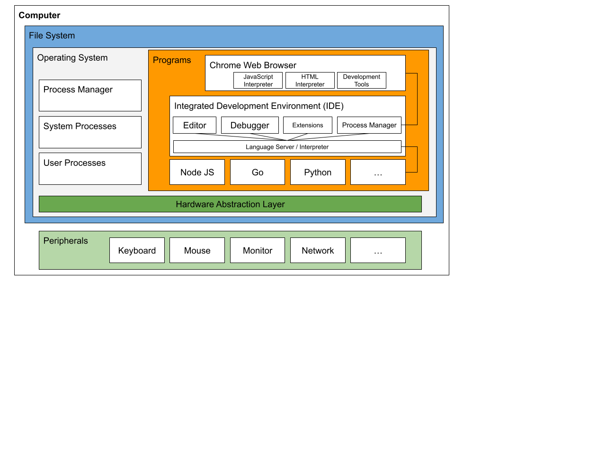

## Install

### All Operating Systems
Download the following software, appropriate for your operating system. Each section below walks through their installation process.

* [Google Chrome](https://www.google.com/chrome/) - If you DO NOT currently have Chrome, download and install this first using the default installation instructions for your operating system.

Once Chrome is installed, open each of these links in a new tab, download all of the appropriate installation files to a Downloads folder in your Home directory. (This is the default download location).
* [Nerd Fonts](https://www.nerdfonts.com/font-downloads) - FiraCode, MesloLG
* [Git SCM](https://git-scm.com/downloads)
* [Visual Studio Code](https://code.visualstudio.com/download)
* [Node JS](https://nodejs.org/en/download)
* [Go](https://go.dev/dl/)
* [Python](https://www.python.org/downloads/)
* [Google Cloud CLI](https://cloud.google.com/sdk/docs/install)

### Apple OS X
Using the search in the top menu bar, type in “Terminal” and launch the app. You should pin the terminal to your Dock (if it’s not already there). The terminal is one of many tools developers use to quickly navigate their operating system. Once open issue the following commands **(The lines that start with a hash ‘#’ sign are comments)**:

When you open your terminal for the first time, it will start
in your home directory, this is referred to as '~' or $HOME.

Install xcode select, this will take a minute. XCode select 
is the open source development environment on OS X and includes
Git, and C++ Compiler tools.

```shell
xcode-select -install

# Make the following directories, we will use them later in the install
mkdir ~/Applications
mkdir ~/Projects
mkdir ~/Fonts

# Now, open your downloads directory in Finder
open ~/Downloads
```

In the finder window, double click on the “zip” and “tar.gz” archives to expand them in the directory.

For every file that ends with “.pkg”, double click those and run through the installation accepting the defaults for each installation.

Since your Finder is already open, Drag-and-drop the “Visual Studio Code” into your Home/Applications directory. (You can add it to Applications, but as a developer you may have one or more versions of applications on the same computer.)

#### Fonts (Optional)
As a developer, we use fonts that have extended character sets (more characters) and are easier to read (good spacing, etc) than standard system fonts. The two fonts we’ve downloaded are two such fonts. They both offer additional characters and contain ligatures. A ligature is a single character representation of one or more characters like math operators for equals == and != (not equal). You DO NOT have to use ligatures to code, they are used to simplify code reading.

Issue the following commands to store the fonts permanently on your system:

```shell
# Change to the Meslo directory
cd ~/Downloads/Meslo

# Remove windows specific fonts
rm -Rf *Windows*

# Change to the FiraCode directory
cd ~/Downloads/FiraCode

# Remove windows specific fonts
rm -Rf *Windows*

# Change to your home directory
cd ~

# Move the fonts to the Fonts directory
mv ~/Downloads/Meslo ~/Fonts
mv ~/Downloads/FiraCode ~/Fonts

# Open the fonts directory in Finder
open ~/Fonts
```

Using the Finder search type “Font Book” and open the application, this is the default font manager on OS X. Once open, drag the Meslo, and FiraCode directories into the font window, this will make the fonts available in your programs.

#### Fixing your terminal
To be fair, your terminal isn’t broken, it’s just not as functional as it could be. By default, newer Macs use ZSH as the default shell. We’re going to add some functionality that makes your shell more useful and easier to understand at a glance.

First, ensure your “Terminal” is selected, and open the terminal settings. Choose your default terminal (This example uses Pro), on the “Text” tab on the right hand side, choose “Meslo LGL DZ Regular Font” and a size that works for you and click “Antialias Text”. On the “Shell” tab ensure “Close the window” is selected for on shell exit.

|  |  | 
| --- | --- |

Now, close your terminal window and open a new one (cmd+q, then double click the icon in the dock).

##### Setting up Power Level 10 K

Now we’re going to extend ZSH by adding some plug-ins.

```shell
# First, install "oh-my-zsh", the following is a single line to paste into
# the Terminal

# The following uncommented line is a single command
sh -c "$(curl -fsSL https://raw.githubusercontent.com/ohmyzsh/ohmyzsh/master/tools/install.sh)"

# Once that is complete, the next command will install a theme, this theme
# is used by many developer to help them identify where they are in their
# terminal visually instead of constantly typing in commands.
# The following uncommented line is a single command
git clone --depth=1 https://github.com/romkatv/powerlevel10k.git ${ZSH_CUSTOM:-$HOME/.oh-my-zsh/custom}/themes/powerlevel10k

# Once complete, open your zsh configuration file with "text edit"
open ~/.zshrc

# Change the line starting with "ZSH_THEME" to
# ZSH_THEME="powerlevel10k/powerlevel10k"
# Save and close the file. (cmd+s, cmd+q)

# Now, close and restart your terminal. You will be asked a series of questions to configure your terminal.
```

A typical set of answers, if you are unsure are as follows (if you don’t see the symbols, do the font step above):
* Diamond: Y
* Lock: Y
* Debian: Y
* Fit: N
* Lean: 1
* Unicode: 1
* 256 Color: 1
* Show Time (12 Hour):  1
* One Line: 1
* Compact: 1
* Many Icons: 2
* Fluent: 2
* Transient Prompt: Y
* Verbose: 1
* Overwrite: Y

Once complete, you should see a new and useful prompt, it will identify git repositories, etc by the decorations on the directory.

#### Node JS, Go, and Python
Good news, you’ve already done all you’ll need to do for Node and Python. You can verify this in the Terminal with the following commands:

```shell
node --version
# Output: v18.16.0

npm --version
# Output: 9.5.1

python3 --version
# Output: Python 3.9.6

go version
# Output: go version go.1.20.3 darwin/arm64
```

#### Google Cloud CLI
This is our last terminal install, but it will require a browser setup component. If you have not, please sign up for a free account on Google by going to “[https://cloud.google.com](https://cloud.google.com)” and click the “start for free” button in the top right corner. You’ll need to enter an email address and password, these will be your credentials in the steps below, so please use the Chrome Password manager to save them for future use.

Once that’s complete, open the terminal and execute the following commands:

```shell
cd ~/Downloads
tar -xf google-cloud-cli-VERSION-darwin-arm.tar
cd google-cloud-sdk
./install.sh
# Then follow the prompts, accepting the default values. 
```

#### Visual Studio Code
This will be our fastest setup as everything we need to do is in the graphical user interface (GUI goo-ie).

Double click on the icon you moved earlier in your $HOME/Applications directory to open Visual Studio Code.

Once open, use cmd+shift+X to open the “extensions” panel. Using the search bar on top, find and install the following extensions:

* Python Extension Pack
* Go
* Go Test Explorer
* React Extension Pack
* Vite (VS Code for Vite)
* Google Cloud Code
* licenser

Once installed, restart Visual Studio Code.

Once restarted, open the command palette (cmd + shift + P) and type: “shell command” and choose the “Install code command on path”. This will make VS Code available from the Terminal.

Lastly, let’s add some global configuration, on the “settings” icon in the lower left corner of VS Code, click “open settings”, then in the top right, you’ll see an arrow over a page, click that icon to open the text view of the settings.

The following settings can be applied globally so you WILL NOT have to do this for every project:

```json
{
 "editor.fontFamily": "FiraCode Nerd Font",
 "editor.fontSize": 14,
 "editor.tabSize": 2,
 "editor.indentSize": "tabSize",
 "editor.autoIndent": "full",
 "editor.fontLigatures": true,
 "terminal.integrated.fontFamily": "MesloLGLDZ Nerd Font",
 "terminal.integrated.fontSize": 14,
 "licenser.license": "AL2",
 "licenser.author": "YOUR NAME HERE",
 "[html]": {
   "editor.suggest.insertMode": "replace",
   "editor.indentSize": "tabSize"
 },
 "[javascriptreact]": {
   "editor.formatOnSave": true,
   "editor.defaultFormatter": "dbaeumer.vscode-eslint",
   "editor.indentSize": "tabSize"
 },
 "[python]": {
   "editor.formatOnType": true,
   "editor.indentSize": "tabSize",
 },
 "[go]": {
   "editor.formatOnSave": true,
   "editor.defaultFormatter": "golang.go",
   "editor.indentSize": "tabSize",
 },
 "gopls": {
   "formatting.gofumpt": true,
   "ui.semanticTokens": true
 }
}
```


** Note: the font size is for HI-DPI displays, please change it to your preference.
Now you’re ready to start coding.

### Windows 10 or 11 with WSL (Preferred)
Using Windows as a web development platform takes a little more TLC, but when we’re complete, your Windows machine will run all of your development tools as if you were programming for a corporation.

We’ll do this by following the process of installing Window’s subsystem for Linux (WSL) which allows you to run Linux on your computer WITHOUT running virtual machines or having complex setups. We do this because all of the tools for web development run best on Linux environments.

Once WSL is installed, we’ll add the new Window’s Terminal, specially designed for accessing WSL and providing a unified experience for Windows IDEs.
Last, we install our interpreters and our IDE so we can start programming.

#### Windows Subsystem for Linux (WSL)
From the search bar, type in Windows Features and choose ‘turn windows features on or off’. Check the following items:
1) “Virtual Machine Platform” and
2)  “Windows Subsystem for Linux”
Then click “OK” and when prompted restart your computer.
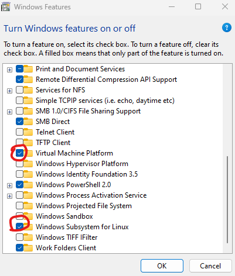

#### Chrome
Download chrome from [https://chrome.google.com](https://chrome.google.com), run the installer and open Chrome. Follow the setup steps for Chrome, and make it your default browser. If you choose not to make Chrome your default browser, that’s okay, but every example will be using Chrome, so please install it so you don’t have to interpolate all instructions.

#### Fonts

Using Chrome, go to [https://www.nerdfonts.com/font-downloads](https://www.nerdfonts.com/font-downloads) and download: ‘FiraCode Nerd Font’ and ‘MesloLG Nerd Font’.

Next, open your downloads directory, right click on each of the downloads and choose ‘Extract All’ from the context menu. Once they are extracted, go to the directory, and in the search bar in the explorer window type ‘windows’, this will show all of the Windows compatible fonts (make sure to click on the ‘show more’ in the search results). Select them all (ctrl+a), right click and choose ‘install’. Do this for both FiraCode and MesloLG.

##### Verify your fonts
On your start menu, type ‘fonts’ into the search bar and click ‘Fonts, control panel’. This will open all of your system fonts. Simply scroll down and see FiraCode and MesloLG in the list.

#### Windows Terminal

If you’re using Windows Version 11 22H2, you will not need to do this step, Terminal is installed by default. You can check your version of Windows by running: search > system settings > system > about. The second panel ‘Windows specification’ should look similar to this:
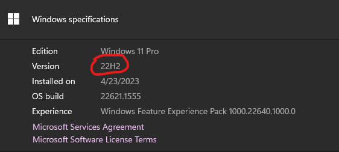

Open your Microsoft Store application, usually on the start menu or in the Taskbar. Type ‘Windows Terminal’ in the search bar. Choose the Windows Terminal application (Not the Preview) and install it.

##### Verify your Terminal
In your taskbar, search for ‘Terminal’, this will open Powershell the first time you run it. Once it’s open, right click on the icon in the taskbar and choose ‘Pin to Taskbar’. The terminal is the developer’s most utilized tool.

##### Setting up your Terminal
While your Terminal is open, look at the top bar, an you’ll see a small down arrow:
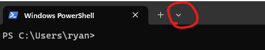

Click here and choose settings. Then choose Profiles > Default > Appearance from the left-hand menu.

In the Font face selection choose ‘MesloLGLDZ NF’, in the color schema choose ‘One Half Dark’. Then choose save.

#### Install Visual Studio Code
This may feel a little backward, but we want to do more complex editing using visual studio code, so we’re going to install it to use it as an editor.

Download Visual Studio Code from [https://code.visualstudio.com/download#](https://code.visualstudio.com/download#) if you share your computers with others, or your computer is managed, you may choose the ‘user installer’.

Once finished installing, launch visual studio code.

#### Installing Linux
Before we can install Linux, we need to update WSL.

Click on this link [WSL Kernel Update](https://wslstorestorage.blob.core.windows.net/wslblob/wsl_update_x64.msi), then run the installer. This will update the WSL kernel to support Windows 11 64bit operating system.

Now update the WSL command and set it to default to version 2 (for modern linux installs).
Open your Terminal, and at the prompt run the following command:

```shell
wsl --set-default-version 2
```

To install linux, open your Microsoft store application again, and in the search bar type in ‘linux’. Here you will see several options for a linux of your choice. For our purposes, we will be using Ubuntu 20.04.06 LTS (long term support). If you choose another version, make sure you know how to use its package manager.

Locate Ubuntu 20.04.06, click the icon, then click install. Upon initial installation, it will prompt you for a username and password, DO NOT forget these.

Once installed, you should see this up and running in Terminal. Since software is package in the past, the first step is to update our Linux install with the following command:

```shell
sudo apt update && sudo apt upgrade 

#### Note: ‘sudo’ means ‘super user do’ and is required for administrative functions like OS updates. Apt (application packaging tool) is used to manage software in Linux, much like Windows updates. Everytime you use sudo, you’ll need to put in your password.

#Before we can install our developer tools, we must let the Linux operating system install essential utilities that are used by Node and Python. This will install Git, C++, G++, etc.

sudo apt install build-essential
```

This can take a minute depending on your internet connection and system speed.

Now, we will change the default shell from Bash to Zsh. We do this to take advantage of plugins in ZSH that can help us be more efficient in the shell. Choose ‘Y’ for the defaults.

```shell
# Install ZSH
sudo apt install zsh

# Setup Oh My Zshell, the following is a single line, copy and paste it in
# your terminal.

sh -c "$(curl -fsSL https://raw.githubusercontent.com/ohmyzsh/ohmyzsh/master/tools/install.sh)"

When prompted, allow the install script to set ZSH as your default shell.

# Setting up Power Level 10K

# Run the following command:
# The following uncommented line is a single command

git clone --depth=1 https://github.com/romkatv/powerlevel10k.git ${ZSH_CUSTOM:-$HOME/.oh-my-zsh/custom}/themes/powerlevel10k 
```

Once complete, type ‘code ~/.zshrc’, this will open the Visual Studio Code editor, using your arrow keys, change

```shell
ZSH_THEME="robbyrusselle"
# To
ZSH_THEME="powerlevel10k/powerlevel10k"
```
Now, save and exit (ctrl+s, ctrl+F4).

Next, from your terminal, activate your new theme with the command:
```shell
source ~/.zshrc
````

And follow the prompts with these answers:
A typical set of answers, if you are unsure are as follows (if you don’t see the symbols, do the font step above):
* Diamond: Y
* Lock: Y
* Debian: Y
* Fit: N
* Lean: 1
* Unicode: 1
* 256 Color: 1
* Show Time (12 Hour):  3
* One Line: 1
* Compact: 1
* Many Icons: 2
* Fluent: 2
* Transient Prompt: Y
* Verbose: 1
* Overwrite: Y

Once complete, you should have a shell that looks similar to the following:
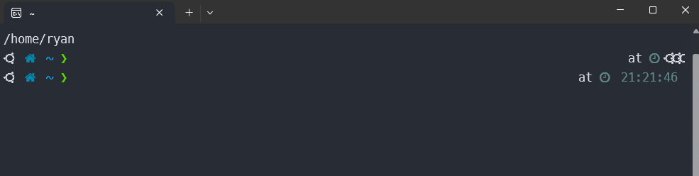

#### Node JS, Go, and Python
We will run all of our commands directly from our Linux terminal for setting up our tools

```shell
# Make a directory for downloads
mkdir Downloads

# Change to the new directory
cd Downloads

# Download Node JS (Interpreter for tools Java Script)

wget https://nodejs.org/dist/v18.16.0/node-v18.16.0-linux-x64.tar.xz

# Download Go (Interpreter and tools for Go)

wget https://go.dev/dl/go1.20.3.linux-amd64.tar.gz

# Python is already installed as part of Linux

# Download Google Cloud CLI

wget https://dl.google.com/dl/cloudsdk/channels/rapid/downloads/google-cloud-cli-427.0.0-linux-x86_64.tar.gz

# Install all of our programs
# From the Downloads directory, run the following command (a single line) to decompress all of our downloaded files.

tar -zxf google-cloud-cli-427.0.0-linux-x86_64.tar.gz && tar -zxf go1.20.3.linux-amd64.tar.gz && tar -xf node-v18.16.0-linux-x64.tar.xz
```

Now, issue the following commands to move these programs to a location we can use them:

```shell
# Make a new directory (~ is a shortcut for home and bin means binary)
mkdir ~/bin

# Move our programs to this directory
mv go ~/bin/go
mv node-v18.16.0-linux-x64 ~/bin/node
```

#### Once all of these are moved, we’ll edit our file one last time to ensure our operating system can find these programs.

```shell
# Open your ZShell user profile using:
code ~/.zshrc 
```

# Add the following lines to the end of the file:
```shell
export GO_HOME=$HOME/bin/go
export NODE_HOME=$HOME/bin/node
export PATH=$GO_HOME/bin:$NODE_HOME/bin:$PATH
```

Save and exit (ctrl+s, ctrl+F4)

From your shell again, use the following commands to verify your environment:

```shell
# Update your profile
source ~/.zshrc

# Verify Python
python --version

# Verify Go
go version

# Verify Node JS
node --version
```

#### Finish your VS Code install
Install the following extensions. From your Linux terminal, open Code with the following command (This will change to your home directory, and open code with your home folder):

```shell
cd ~ && code .
```

You will be automatically prompted to install WSL and restart. Do that, then close code and run the same command above. This will install a process on Linux to allow it to seamlessly use VS Code on Windows.

Now, click on the extension icon on the left, you’ll see something like this:
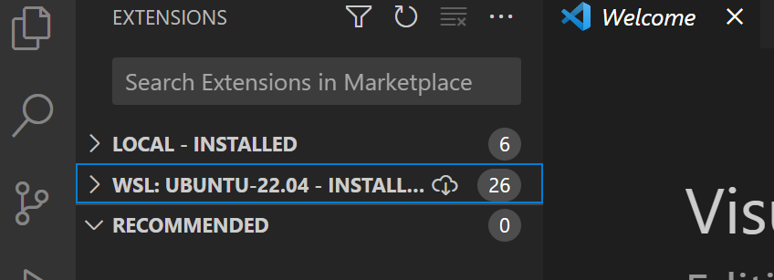

Make sure to select the WSL vertical tab, then install the following plugins:

* Python Extension Pack
* Go
* Go Test Explorer
* React Extension Pack
* Vite (VS Code for Vite)
* Google Cloud Code
* Licenser

These steps install the plugins on your WSL instance, giving them access to Node JS, Python, Go, C++, etc.

Lastly, let’s add some global configuration, on the “settings” icon in the lower left corner of VS Code, click “open settings”, then in the top right, you’ll see an arrow over a page, click that icon to open the text view of the settings.

The following settings can be applied globally so you WILL NOT have to do this for every project:


```json
{
 "editor.fontFamily": "FiraCode Nerd Font",
 "editor.fontSize": 14,
 "editor.tabSize": 2,
 "editor.indentSize": "tabSize",
 "editor.autoIndent": "full",
 "editor.fontLigatures": true,
 "terminal.integrated.fontFamily": "MesloLGLDZ Nerd Font",
 "terminal.integrated.fontSize": 14,
 "licenser.license": "AL2",
 "licenser.author": "YOUR NAME HERE",
 "[html]": {
   "editor.suggest.insertMode": "replace",
   "editor.indentSize": "tabSize"
 },
 "[javascriptreact]": {
   "editor.formatOnSave": true,
   "editor.defaultFormatter": "dbaeumer.vscode-eslint",
   "editor.indentSize": "tabSize"
 },
 "[python]": {
   "editor.formatOnType": true,
   "editor.indentSize": "tabSize",
 },
 "[go]": {
   "editor.formatOnSave": true,
   "editor.defaultFormatter": "golang.go",
   "editor.indentSize": "tabSize",
 },
 "gopls": {
   "formatting.gofumpt": true,
   "ui.semanticTokens": true
 }
}
```

### Windows 10/11 without WSL (Discouraged)

Before beginning this process, you MUST set aside your desire to click through every pop-up as quickly as possible. The process WILL NOT use default install locations, because you MUST know where the products are being installed. Defaults installs ARE FOR NON DEVELOPERS.

#### Preparation
Open your file explorer and navigate to your ‘C’ drive. Once there, create a folder called ‘dev’, this will be referred to as your install root or c:\dev. All downloaded development tools will be stored here.

From the above section, you should install the Windows Terminal and Fonts. ([Windows 11 with WSL (Preferred)](#heading=h.h803oi9f3mwz))

Download the following development tools:

* Go [https://go.dev/dl/go1.20.3.windows-amd64.msi](https://go.dev/dl/go1.20.3.windows-amd64.msi)
* Node JS [https://nodejs.org/dist/v18.16.0/node-v18.16.0-x64.msi](https://nodejs.org/dist/v18.16.0/node-v18.16.0-x64.msi)
* Python ([https://www.python.org/ftp/python/3.11.3/python-3.11.3-amd64.exe](https://www.python.org/ftp/python/3.11.3/python-3.11.3-amd64.exe))
* Git [https://github.com/git-for-windows/git/releases/download/v2.40.0.windows.1/Git-2.40.0-64-bit.exe](https://github.com/git-for-windows/git/releases/download/v2.40.0.windows.1/Git-2.40.0-64-bit.exe)

Navigate to your Downloads folder, and execute the following installers:

##### Git

When prompted, change the default location to “c:\dev\git”
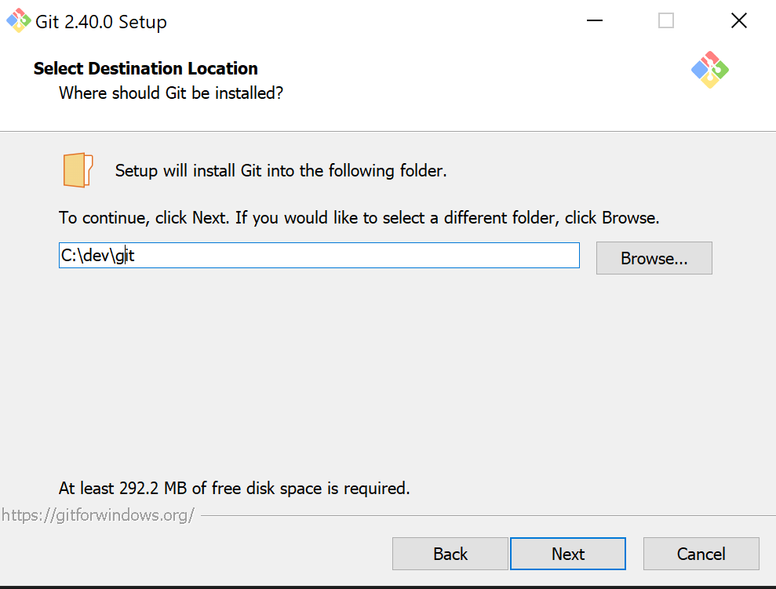
Accept defaults until you get to the choose editor screen, and select “Visual Studio Code”:
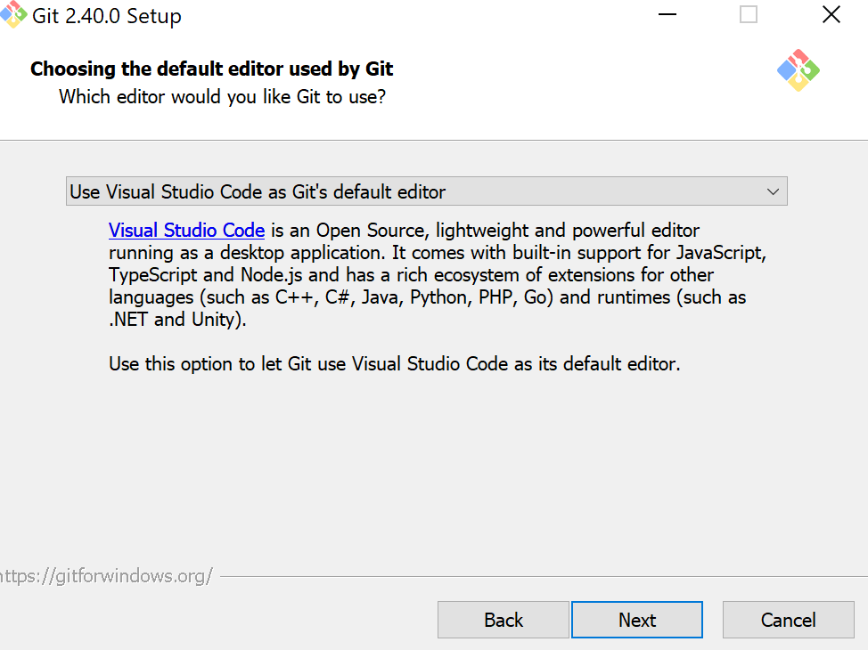

Then select to override the default branch to “main”.
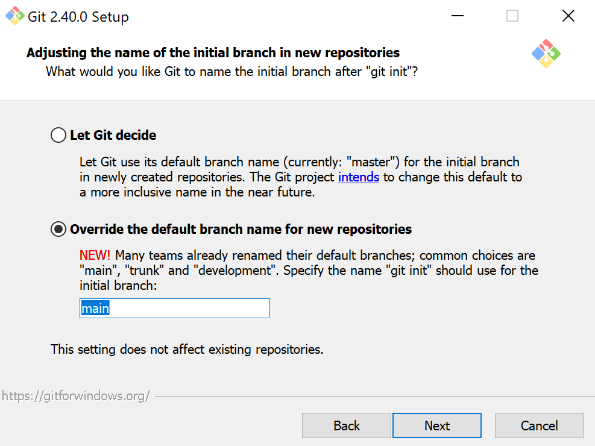

Then select defaults until the line endings screen and change to:
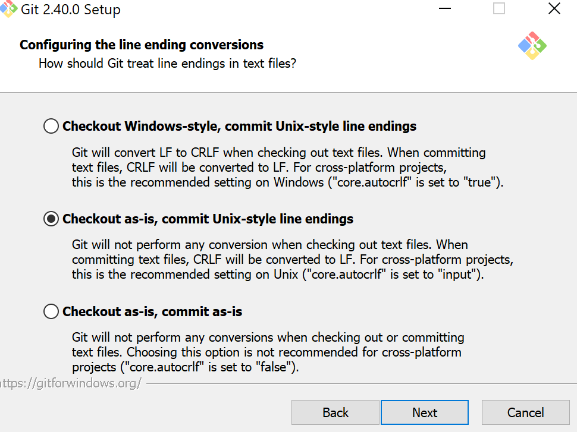
Then accept defaults until complete.

##### Go

Go, make sure to change the install location on the following screen to ‘c:\dev\go”.
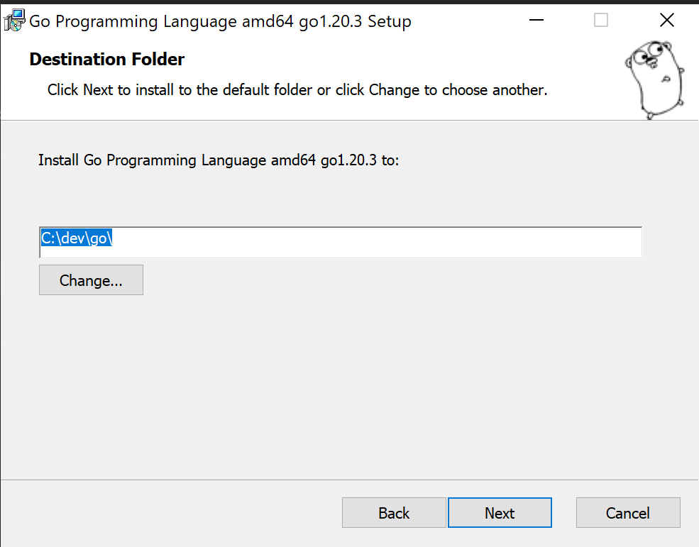


##### Python
Choose custom install from the initial screen, change the python default location to “c:\dev\python” and check the following options.
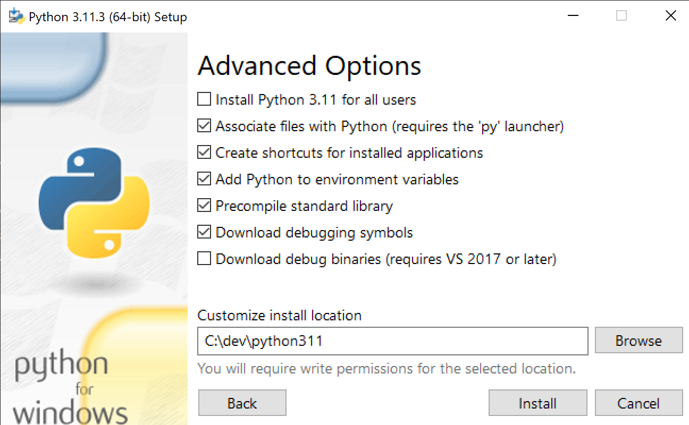

##### Node JS
On the install directory screen, enter ‘c:\dev\nodejs’. Then ensure you check “Install the necessary tools…”, then complete the install. A terminal window will appear, simply accept and use the defaults to install ‘Chocolaty’, a Windows package manager for additional tools.
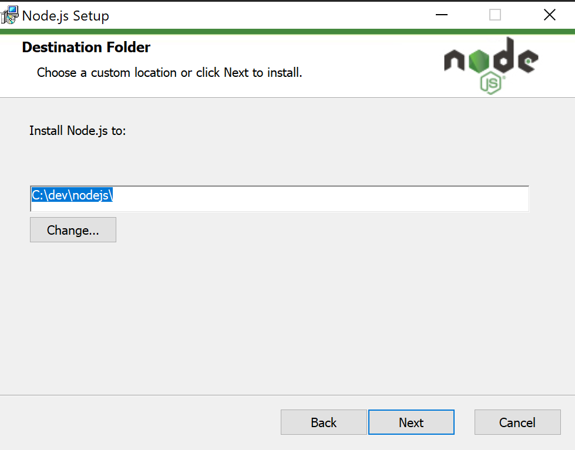

Now, restart your computer, because it’s windows and if Powershell was opened once, it won’t read new variables until restarted.

#### Validation
At this point, all of the tools are installed on your computer. To verify they are installed, open your Windows Terminal Powershell and issue the following commands:

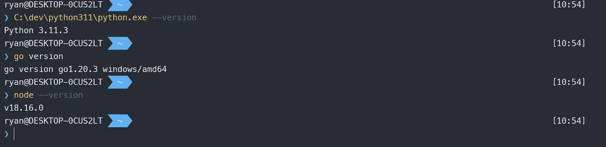